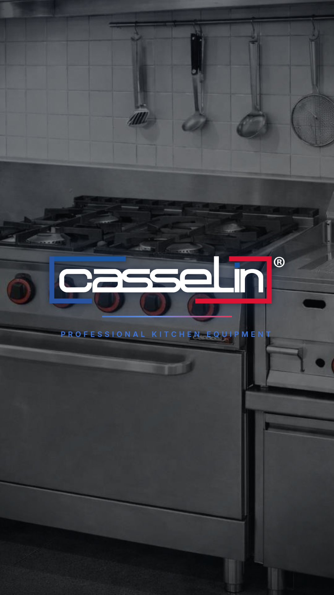

# Casselin — Industrial Premium Video Ad (Remotion)

A 30-second advertisement for **Casselin**, the French manufacturer of professional
kitchen equipment for fast food, snacking, hotels and the wider CHR market. Built
with [Remotion](https://www.remotion.dev/).

It uses the **real brand identity** pulled from [casselin.com](https://www.casselin.com/fr/):
the official **logo**, the real **tricolore brand colours** (blue `#234E9E` + red
`#DD1232`, sampled from the logo) and the real **product photography** (`/public/brand`).

The direction targets the visual language of premium industrial brands — **Bosch
Professional, Siemens, Electrolux B2B**: cold controlled light, brushed stainless
steel, real graded photography, an engineering-dashboard UI, spring physics and
**never** a linear animation. Every frame is engineered to read "premium French
industrial leader".

**Masters:** `AdVideo` 1080×1920 (9:16) · `AdVideoWide` 1920×1080 (16:9) · 30 fps ·
900 frames · H.264 (MP4). Both render from one timeline.



> Scene posters: [`previews/`](previews) — one representative frame per scene.

---

## Quick start

```bash
npm install

npm run studio        # open Remotion Studio (live preview / scrubbing)
npm run render        # render the vertical 9:16 master → out/casselin-ad-9x16.mp4
npm run render:wide   # render the 16:9 master        → out/casselin-ad-16x9.mp4
npm run render:all    # render both masters
npm run render:hd     # higher-quality vertical master (PNG frames, crf 16)
npm run still         # export the brand-stamp poster → out/poster.png
npm run typecheck     # strict TypeScript check
```

Composition ids: **`AdVideo`** (vertical) and **`AdVideoWide`** (16:9).

---

## Project structure

```
src/
  index.ts                 registerRoot entry
  Root.tsx                 Registers the 9:16 + 16:9 compositions, preloads fonts
  Video.tsx                Master timeline — sequences all 7 scenes with cross-fades
  theme.ts                 Design system: steel/cold/red tokens, gradients, springs, scene map
  animations.ts            Reusable motion helpers (fadeUp, fadeInOut, springScale, eased…)
  font.ts / fonts.ts       Self-hosted Inter (base64 woff2 → FontFace), no network needed
  components/
    Background.tsx         Industrial canvas: cold light pools + blueprint grid (+ rgba helper)
    Grain.tsx              Film grain + cinematic vignette
    Stage.tsx              Adaptive 1080×1920 design canvas → drives both aspect ratios
    Photo.tsx              Graded real-photo Ken Burns + engineering CornerTicks
    SteelPanel.tsx         Brushed stainless-steel surface
    DashboardFrame.tsx     Engineering-dashboard chrome (titled control surface)
    Telemetry.tsx          Radial Gauge / Readout / Bar instrumentation
    Equipment.tsx          Vector stainless-steel equipment icons (used as accents)
    EuropeMap.tsx          France-hub → Europe logistics flow network
    Wordmark.tsx           The real Casselin logo asset with a soft cold halo
    AnimatedText.tsx       Word-by-word Headline + Kicker (ink / steel / cold / accent tones)
  scenes/
    Scene01Impact.tsx … Scene07Brand.tsx
public/brand/              Real Casselin logo + product photography (from casselin.com)
public/fonts/              Vendored Inter woff2 weights (source for fonts.ts)
scripts/generate-fonts.mjs Regenerates src/fonts.ts from the woff2 files
```

### One design canvas, two deliverables
Every scene composes against a fixed **1080×1920** space wrapped in `Stage`, which
scales and centers that space to fit whatever composition runs it. The identical
scene code therefore drives both the vertical and the 16:9 master; in 16:9 the
industrial `Background` fills the surrounding frame as deliberate side framing.

### Why the design holds together
Everything reads from `theme.ts` — no scene hardcodes a raw hex. The brushed-steel
ramp, the cold engineering light, the single Casselin red, the signature
*easeOutExpo* settle curve and three spring presets (`hero`, `panel`, `snappy`) are
shared across all scenes, which is what gives the film one coherent, leader-grade
voice. The equipment is **pure vector** (no bitmaps), so it stays razor-sharp at any
scale and renders identically on the farm.

---

## Scene breakdown — timings, visuals, animation, copy

Timings are frames @ 30 fps (`SCENES` in `theme.ts`). Scenes overrun by 12 frames so
they **cross-fade** through the shared industrial canvas (see `Video.tsx`).

| # | Scene | Time | Frames |
|---|-------|------|--------|
| 1 | Impact | 0.0–2.0s | 0–60 |
| 2 | Promise | 2.0–5.0s | 60–150 |
| 3 | Solution | 5.0–10.0s | 150–300 |
| 4 | Industrial Power | 10.0–15.0s | 300–450 |
| 5 | Complete Ecosystem | 15.0–20.0s | 450–600 |
| 6 | Logistics | 20.0–25.0s | 600–750 |
| 7 | Brand Ending | 25.0–30.0s | 750–900 |

### Scene 1 — Impact · `Casselin. Professional kitchen equipment.`
Black hold → a cold specular highlight **sweeps across a brushed-inox slab** → the
**CASSELIN** mark stamps in like a laser etch, a red index line draws beneath it and
the positioning line resolves. Asserts "premium industrial leader" in under 2s.
*Motion:* `easeOutExpo` specular sweep, `SPRING` stamp-in, eased line draw.

### Scene 2 — Promise · `Speed. Reliability. Performance.`
Three engineered guarantees punch in on weighted beats, each backed by a **live
radial gauge climbing to full** (48H delivery · 99.9% uptime · MAX output). The
implied contrast with a slow, chaotic kitchen is the relentless, instrumented
confidence. *Motion:* `SPRING.hero` word punches, eased gauge fill, bottom progress ticks.

### Scene 3 — Solution · `Everything your kitchen needs.`
A Casselin **catalogue console** (`DashboardFrame`): the core units snap into a
steel grid in rapid sequence — fryer, grill, oven, toaster, bain-marie, griddle —
each on its own milled tile with a part label. *Motion:* staggered `SPRING.snappy`
tile reveals, eased frame entrance.

### Scene 4 — Industrial Power · `Designed for professionals.`
A single unit close-up **runs under load** on a steel panel: core temperature
climbs to 320 °C, power holds at 9.0 kW, the duty-cycle bar pulses **HEAVY** — the
instrumented proof of intensive, all-service performance, under a slow cinematic
push-in. *Motion:* eased telemetry ramps, sinusoidal heat bloom, scene-wide zoom.

### Scene 5 — Complete Ecosystem · `Cooking. Preparation. Cold. Hygiene.`
The full range, **segmented like a digital catalogue**: four ranges reveal in
sequence, each a steel row of its core units with a colour-coded edge, the matching
word igniting as its row lands. *Motion:* per-row slide-in, staggered `SPRING` icon pops.

### Scene 6 — Logistics · `Stock. Fast delivery. Europe-wide service.`
A **France hub dispatches cold-light flows across Europe** (`EuropeMap`) while live
operational readouts build: 12,000+ units in stock, 24–48H France, EU-wide coverage.
The scale-and-reach proof beat. *Motion:* progress-driven arc draw + node ignition,
counting readouts.

### Scene 7 — Brand Ending · `Casselin. Built for performance.` / `Professional kitchen equipment.`
The mark settles on a luminous industrial field under a slow push-in, the red index
line draws, the positioning line resolves and the frame **fades clean**. The
signature of a leader. *Motion:* `SPRING` lockup, breathing cold bloom, eased fade-out.

---

## All on-screen copy (in order)

1. **Casselin.** — *Professional kitchen equipment.*
2. **Speed. · Reliability. · Performance.**
3. **Everything your kitchen needs.**
4. **Designed for professionals.** — *Built to run all service.*
5. **One complete ecosystem.** — *Cooking. Preparation. Cold. Hygiene.*
6. **Shipped across Europe.** — *Stock · Delivery · Service · 24–48H France*
7. **Built for performance.** — *Professional kitchen equipment.*

---

## Customizing

- **Copy & timings** — every headline and the `SCENES` frame map live in `theme.ts`
  / each scene file; change text in one place.
- **Colours & finish** — edit the `COLORS` / `GRADIENTS` tokens in `theme.ts`
  (steel ramp, cold light, Casselin red); the whole film re-skins instantly.
- **Equipment** — add or swap units in `components/Equipment.tsx` (pure SVG paths on
  a shared 120×120 grid) and reference them in the Solution / Ecosystem scenes.
- **Logistics reach** — edit the `NODES` in `components/EuropeMap.tsx`.
- **Fonts** — drop new woff2 weights in `public/fonts/`, run
  `node scripts/generate-fonts.mjs`, and adjust `FONT.family` in `theme.ts`.

## Technical notes

- **No linear motion.** All movement uses spring physics or the bezier easings
  defined in `theme.ts` (`EASE.expo`, `EASE.soft`, `EASE.inOut`).
- **Self-contained fonts.** Inter is embedded as base64 woff2 and registered via the
  FontFace API, so renders never depend on a font CDN.
- **Deterministic.** Grain uses a seeded noise field and all equipment is vector;
  output is identical across runs and render nodes.
