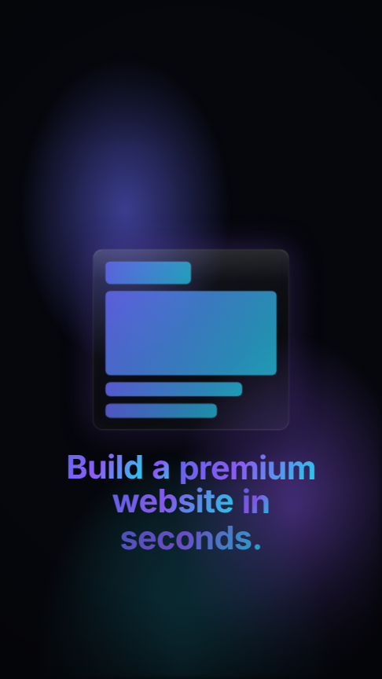

# Casselin — Premium SaaS Video Ad (Remotion)

A 30-second, vertical **9:16** advertisement for an AI website builder, built with
[Remotion](https://www.remotion.dev/). The direction targets the visual language of
Apple keynotes, Stripe and Tesla ads: deep canvas, soft brand gradients,
glassmorphism, light blooms, spring physics and **never** a linear animation.

**Format:** 1080 × 1920 · 30 fps · 900 frames · H.264 (MP4).



> Scene posters: [`previews/`](previews) — one representative frame per scene.

---

## Quick start

```bash
npm install

npm run studio        # open Remotion Studio (live preview / scrubbing)
npm run render        # render the full ad → out/casselin-ad.mp4
npm run render:hd     # higher-quality master (PNG frames, crf 16)
npm run still         # export the poster frame → out/poster.png
npm run typecheck     # strict TypeScript check
```

The composition id is **`AdVideo`**.

---

## Project structure

```
src/
  index.ts                 registerRoot entry
  Root.tsx                 Composition registration + font preload
  Video.tsx                Master timeline — sequences all 7 scenes with cross-fades
  theme.ts                 Design system: colors, gradients, easings, springs, scene map
  animations.ts            Reusable motion helpers (fadeUp, fadeInOut, springScale, eased…)
  font.ts / fonts.ts       Self-hosted Inter (base64 woff2 → FontFace), no network needed
  components/
    Background.tsx         Animated aurora gradient canvas (+ rgba helper)
    Grain.tsx              Film grain + cinematic vignette
    GlassCard.tsx          Frosted glassmorphism surface
    BrowserFrame.tsx       Realistic macOS browser chrome
    AnimatedText.tsx       Word-by-word Headline + Kicker
  scenes/
    Scene01Hook.tsx        … Scene07CTA.tsx
public/fonts/              Vendored Inter woff2 weights (source for fonts.ts)
scripts/generate-fonts.mjs Regenerates src/fonts.ts from the woff2 files
```

### Why the design holds together
Everything reads from `theme.ts` — no scene hardcodes a raw hex. The brand spectrum
(indigo → violet → cyan, with pink/mint accents), the signature *easeOutExpo* settle
curve, and three spring presets (`hero`, `panel`, `snappy`) are shared across all
scenes, which is what gives the film one coherent, high-end voice.

---

## Scene breakdown — timings, visuals, animation, copy

Timings are frames @ 30 fps (`SCENES` in `theme.ts`). Scenes overrun by 12 frames so
they **cross-fade** through the shared dark canvas (see `Video.tsx`).

| # | Scene | Time | Frames |
|---|-------|------|--------|
| 1 | Hook | 0.0–2.0s | 0–60 |
| 2 | Problem | 2.0–5.0s | 60–150 |
| 3 | Solution | 5.0–10.0s | 150–300 |
| 4 | Magic AI | 10.0–15.0s | 300–450 |
| 5 | Result | 15.0–20.0s | 450–600 |
| 6 | Emotion | 20.0–25.0s | 600–750 |
| 7 | CTA | 25.0–30.0s | 750–900 |

### Scene 1 — Hook · `Build a premium website in seconds.`
Black hold → a gradient **light beam** splits the frame → a futuristic glass UI
**snaps in** with a brief chromatic-aberration *glitch* (RGB split via cyan/pink
ghost layers) and "builds" its blocks in sequence. Headline assembles word-by-word
in a brand gradient. Job: earn the next 28 seconds in under 3.
*Motion:* beam `easeOutExpo` width sweep, `SPRING.panel` snap-in, staggered block reveal.

### Scene 2 — Problem · `Designing websites is slow, expensive, complicated.`
Controlled chaos: four tilted tool panels (`design.fig`, `index.tsx`, `builder.app`,
`styles.css`) crowd in and gently wobble. Three friction words punch on hard cuts —
**"Slow." → "Expensive." → "Complicated."** — each scaling down from 1.25 with a glow.
Then everything **implodes** (scale-down + blur) to hand off to the solution.
*Motion:* per-panel spring entrance, `floaty` wobble, quartic-ease word punches.

### Scene 3 — Solution · `Just paste your idea or URL.`
A single beautiful prompt field. The idea **types itself** in with a blinking caret
(`A premium studio for handmade ceramics`), input/chip row (`URL · Idea · Brand`),
then the **Generate** button **commits** with a light pulse and an expanding ring.
*Motion:* typewriter interpolation, caret blink, `easeOutExpo` press, radial pulse.

### Scene 4 — Magic AI · `Our AI builds everything for you.`
The value reveal. Inside a real **browser frame** the site assembles live —
hero image → headline → copy → feature cards → **brand palette** — block by block,
with a **shimmer sweep** that tracks progress. A floating glass status chip narrates
`Layout → Imagery → Copywriting → Branding` with a live `%` and spinner.
*Motion:* progress-driven staged reveals, screen-blend shimmer, rotating spinner.

### Scene 5 — Result · `Ready-to-sell website. Instantly.`
The payoff. A finished, genuinely premium landing page (`Atelier Noir` ceramics shop:
nav, gradient hero, product grid, shipping banner) **auto-scrolls** smoothly inside the
browser frame, proving the output is real. A **"Published"** toast lands at the end.
*Motion:* `easeInOut` scroll, top/bottom depth fades, spring toast.

### Scene 6 — Emotion / Impact · `Launch like a billion-dollar startup.`
Aspirational beat. The site lives across **phone, laptop and tablet**, floating in a
violet **light bloom**, under a slow **cinematic push-in** (1.12 → 1.0 over the scene).
*Motion:* per-device spring entrance, continuous `floaty` drift, full-scene zoom.

### Scene 7 — CTA · `Create your website in seconds.` / `Start now — no code, no agency, no limits.`
The close. Brand lockup (**Casselin** + spark mark), gradient headline, one luminous
**CTA button** with a breathing glow on a living gradient. A **cursor glides in and
clicks** — a ripple radiates — the final micro-interaction inviting the viewer to do
the same. Trust row: `★★★★★ 12,000+ sites launched`.
*Motion:* spring lockup/button, `easeOutExpo` cursor travel, click ripple, breathe glow.

---

## All on-screen copy (in order)

1. **Build a premium website in seconds.**
2. **Slow. · Expensive. · Complicated.** — *Designing websites is slow, expensive, complicated.*
3. **Just paste your idea or URL.** — `A premium studio for handmade ceramics` · Generate
4. **Our AI builds everything for you.** — Layout / Imagery / Copywriting / Branding
5. **Ready-to-sell website. Instantly.** — Published
6. **Launch like a billion-dollar startup.**
7. **Create your website in seconds.** — *Start now — no code, no agency, no limits.* — **Build my website**

---

## Customizing for your brand

- **Copy & timings** — every headline and the `SCENES` frame map live in
  `theme.ts` / each scene file; change text in one place.
- **Colors & gradients** — edit the `COLORS` / `GRADIENTS` tokens in `theme.ts`;
  the whole film re-skins instantly.
- **Brand name / logo** — `Scene07CTA.tsx` (`Casselin` lockup) and `BrowserFrame` URLs.
- **Demo site** — `Scene05Result.tsx`'s `FinishedSite` is plain JSX; swap in your niche.
- **Fonts** — drop new woff2 weights in `public/fonts/`, run
  `node scripts/generate-fonts.mjs`, and adjust `FONT.family` in `theme.ts`.

## Technical notes

- **No linear motion.** All movement uses spring physics or bezier easings defined in
  `theme.ts` (`EASE.expo`, `EASE.soft`, `EASE.inOut`).
- **Self-contained fonts.** Inter is embedded as base64 woff2 and registered via the
  FontFace API, so renders never depend on a font CDN.
- **Deterministic.** Grain uses a seeded noise field; output is identical across runs
  and render nodes.
